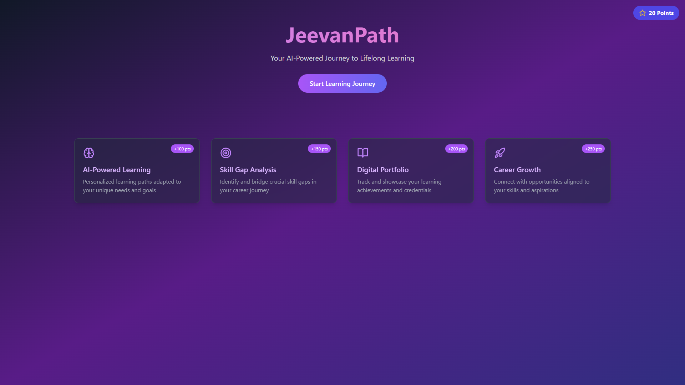
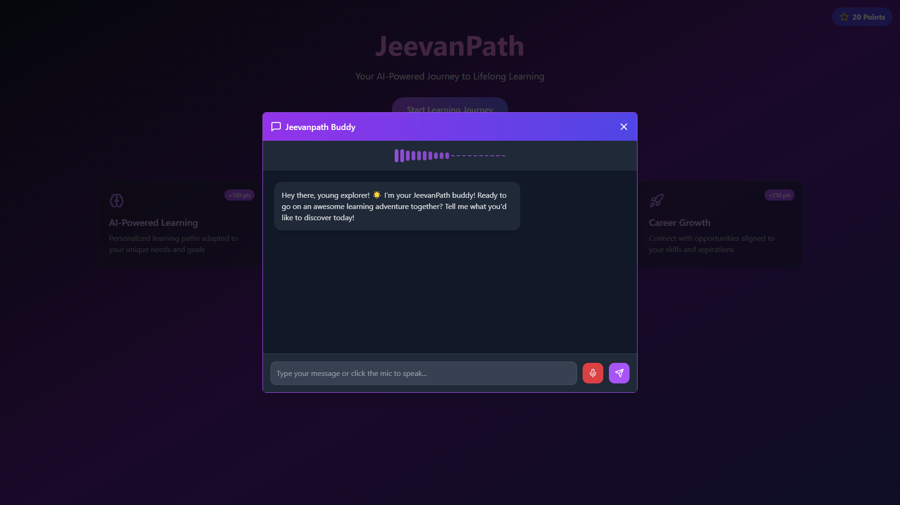
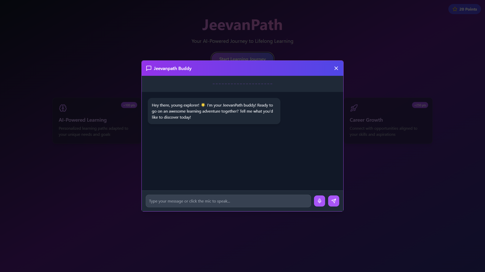

# Jeevanpath
# 🧠 JeevanPath – Voice-Enabled AI Learning Buddy

JeevanPath is a smart voice-enabled chatbot built with **React**, **TailwindCSS**, **Google Generative AI (Gemini API)**, **Node.js**, and **MySQL**. Designed as an interactive learning companion, it helps users (especially students) learn through conversations, voice input, and gamified rewards.

## 🚀 Features

- 🎧 Voice recognition with real-time waveform visualization  
- 🤖 AI-powered responses using Google Generative AI (Gemini)  
- 🗏️ Conversation history and user messages  
- 🎯 Points-based gamification system  
- 🔐 Customizable API key setup  
- ⚡ Responsive and elegant UI using TailwindCSS  

## 📦 Tech Stack

| Frontend           | Backend          | AI Integration          | Database |
|--------------------|------------------|-------------------------|----------|
| React + TypeScript | Node.js + Express| Google Generative AI    | MySQL    |

## 📁 Project Structure

```
/Frontend
  ├── components/
  ├── pages/
  └── styles/

/Backend
  ├── App.js
  ├── db.js
  ├── Package.json
  └── package-lock.json


README.md
```

## 🛠️ Setup Instructions

### 1. Clone the Repository
```bash
git clone https://github.com/Girijaray07/Project-Jeevanpath.git
cd jeevanpath
```

### 2. Install Dependencies

#### Frontend
```bash
cd Frontend
npm install
```

#### Backend
```bash
cd Backend
npm install
```

### 3. Setup `.env` File

Create a `.env` file in the `Backend` directory:

```env
PORT=3000
DB_HOST=localhost
DB_USER=root
DB_PASSWORD=yourpassword
DB_NAME=gemini
GOOGLE_API_KEY=your_google_generative_ai_key
```

### 4. Run the App

#### Start Backend
```bash
cd Backend
npm run dev
```

#### Start Frontend
```bash
cd Frontend
npm run dev
```

## 🔐 API Reference

### POST `/generate-response`
- **Request:** `{ userMessage: string }`
- **Response:** `{ response: string }`

## 💡 Future Enhancements

- Save and load previous conversations  
- Integrate more subject-specific AI models  
- Add multilingual support  
- Deploy on cloud (Render, Vercel, Railway, etc.)  

## 📸 Screenshots
*Home Page*
 
*Chat Bot (With Voice)*
 
*Chat Bot (Without Voice)*


## 🧑‍💻 Author

**Team - ZynteX**  
GitHub: [@suryanshkishor](https://github.com/suryanshkishor)  
Email: suryanshkishor50555@gmail.com
